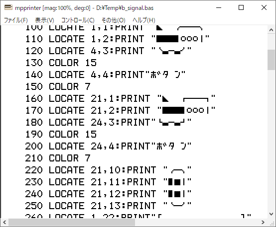

#  MPPRINTER

### このソフトは、レトロPCエミュレータのプリンタ出力にて得られるデータファイルを昔懐かしいプリンタフォントで閲覧、印刷するものです。

### [ダウンロード](https://github.com/bml3mk5/MPPrinter/releases)

### [ドキュメント](../../tree/main/docs)

------------------------------------------------------------------------------
### This software is a printer emulator for viewing and printing data files using old-fashioned printer fonts.

### [Downloads](https://github.com/bml3mk5/MPPrinter/releases)

### [Documents(Japanese)](../../tree/main/docs)

------------------------------------------------------------------------------

## Disclaimer 免責事項

* This is the free software. I have not abandoned the copyright.
  And each author which created the source code also have the copyright.
* これはフリーソフトです。ただし著作権は放棄していません。
  ソースコードを作成した各々の作者にも著作権があります。
* No warranty: We are not responsible for any damage caused by this software.
* 無保証: このソフトを使用したいかなる損害も一切保証しません。

------------------------------------------------------------------------------

 MailTo: Sasaji (sasaji@s-sasaji.ddo.jp)
 * My WebPage: http://s-sasaji.ddo.jp/bml3mk5/
 * GitHub:     https://github.com/bml3mk5/MPPrinter
 * X(Twitter): https://x.com/bml3mk5

------------------------------------------------------------------------------
